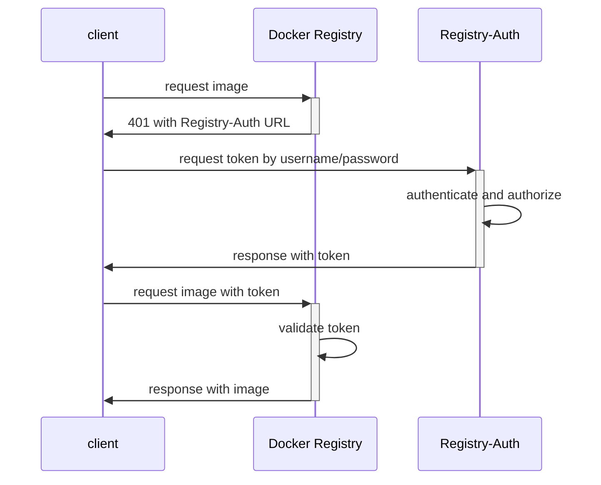
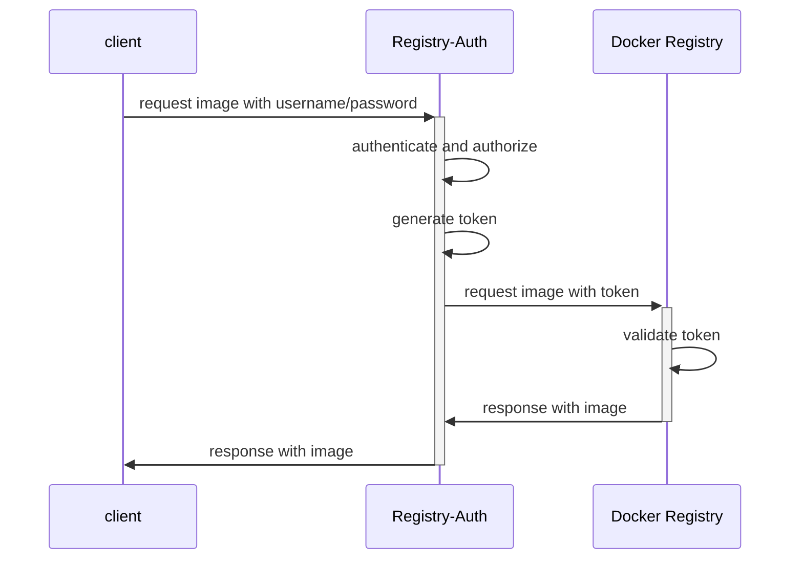

# Registry-Auth


----

`Registry-Auth` providers authentication and authorization for [Docker Registry](https://github.com/distribution/distribution).

Docker Registry can be configurated with three kinds of authentications:

  * **silly** which is only appropriate for development. It simply checks for the existence of the Authorization header in the HTTP request. It does not check the header’s value.

  * **htpasswd** which supports username and password authentication. Docker Registry loads the `htpasswd` config once when startup. The `htpasswd` only resolves the authentication problem, but can not provide authorizations.

  * **token** which supports authentication and authorization. It takes the `JWT` format including the token's validation period and authorized actions. You can set each repository's accessibilities for users.

    For example, user `test1` can only pull from repository `repo1`, while user `test2` can push and pull from repository `repo2`.

  * Besides mentioned above, there is a `proxy` authentication method described in Docker's deploying document. A `proxy` will be deployed before the Docker Registry, which can process the authentication.

    The references about the `proxy` are here:
    1. https://docs.docker.com/registry/deploying/#more-advanced-authentication
    2. https://docs.docker.com/registry/recipes/apache/
    3. https://docs.docker.com/registry/recipes/nginx/

Registry-auth has implemented the token and the proxy authentication.

## Quick Start

The following script will run a simple Registry-Auth and Docker Registry service. It then tests the docker login and pushes and pulls images.

```bash
#!/bin/bash

# generate certificates
openssl req -new -newkey rsa:2048 -days 365 -x509 -keyout server.key -out server.crt -nodes -subj '/CN=registry-auth-server'
openssl req -new -newkey rsa:2048 -days 365 -x509 -keyout token.key -out token.crt -nodes -subj '/CN=registry-auth-token'

# generate a demo auth config
# only admin can push images but anyone can pull images
cat <<EOF > ./auth.yaml
users:
  admin: admin
auths:
  admin:
  - target: .*
    useRegexp: true
    actions:
    - pull
    - push
  _anonymous:
  - target: .*
    useRegexp: true
    actions:
    - pull
EOF

# run Registry-Auth
docker run -d --name registry-auth -p 8080:8080 \
  -v $(pwd):/etc/registry-auth \
  ghcr.io/alauda/registry-auth:latest \
  --server-tls-cert-file=/etc/registry-auth/server.crt \
  --server-tls-key-file=/etc/registry-auth/server.key \
  --auth-public-cert-file=/etc/registry-auth/token.crt \
  --auth-private-key-file=/etc/registry-auth/token.key \
  --auth-config-file=/etc/registry-auth/auth.yaml

# run docker registry
docker run -d \
  --name registry \
  --network container:registry-auth \
  -v $(pwd)/token.crt:/etc/registry-auth/token.crt \
  -e REGISTRY_AUTH_TOKEN_AUTOREDIRECT=true \
  -e REGISTRY_AUTH_TOKEN_REALM=/auth/token \
  -e REGISTRY_AUTH_TOKEN_SERVICE=token-service \
  -e REGISTRY_AUTH_TOKEN_ISSUER=registry-token-issuer \
  -e REGISTRY_AUTH_TOKEN_ROOTCERTBUNDLE=/etc/registry-auth/token.crt \
  registry:2.8

# tests

docker login 127.0.0.1:8080 -u admin -p admin
docker tag registry:2.8 127.0.0.1:8080/registry:2.8
docker push 127.0.0.1:8080/registry:2.8
docker logout 127.0.0.1:8080
docker rmi 127.0.0.1:8080/registry:2.8
docker pull 127.0.0.1:8080/registry:2.8
```

## The Token Authentication

When using the token authentication, the Registry-Auth and the Docker Registry will use the same x509 certificate to sign and verify the token. The token is signed by the Registry-Auth and will be verified by the Docker Registry.

When the client (such as docker, containerd, etc.) accesses the Docker Registry firstly, the token does not exist in the HTTP headers. The Docker Registry will respond with an authentication fail with status code 401, and the "WWW-Authenticate" header is added in the response, which includes the Registry-Auth's URL.

Then the client will send the username and password to Registry-Auth by the Basic Authorization method for a valid token. The Registry-Auth will check the username and password and also the user's authorized repositories. After all the checks are passed, it will sign a token for the client.

The client then accesses the Docker Registry secondly with the token. And the Docker Registry will respond with the image content after validating the token.

The sequence of token authentication is here:


## The Proxy Authentication

The Registry-Auth's proxy authentication works with token authentication. The Registry-Auth is deployed before the Docker Registry as a proxy, but token authentication is also taken between Registry-Auth and Docker Registry. When using proxy authentication, only one access endpoint is needed, which will simplify the deployment and reduce the client's requests.

When the client access Registry-Auth (also the Docker Registry) with the Basic Authorization header, the Registry-Auth will check the username and password and also the user's authorized repositories, and then sign a token. The token is transmitted to the Docker Registry with the origin request.

The Docker Registry will respond with the image content after validating the token.

The sequence of proxy authentication is here:


## Configurations

Registry-auth can load a config file set by the argument `--auth-config-file`. The config file contains the usernames, passwords and authorizations for repositories.

The format and example of the configuration are here:

  ```yaml
    users:
      user1: password1           # use the plaintext password for user1
      # use the bcrypt encrypted password, the password can be generated by command: `htpasswd -nbB user2 password2`
      user2: $2y$05$o.txf8NBl17CimmIKybYYe9SmIcAzctQ84.UbFCObPFxt78W1DEJW
    auths:
      user1:                     # user1's configs
      - target: usersrepo/test1  # repository name
        actions:                 # allowed actions
        - pull
        - push
      - target: team1repo/.*     # use regexp to match repository name
        useRegexp: true          # stands for the regexp will be used
        actions:
        - pull
      _anonymous:                # the configs for anonymous user, the anonymous user need not provide username and password to login
      - target: .*
        useRegexp: true
        actions:
        - pull
  ```

Registry-auth can load configurations from Kubernetes secrets through the arguments `--auth-config-selector`, `--auth-config-selector` and `--kubeconfig`. The configurations in the secrets are preferred to those loaded from the config file.

The secret example:

```yaml
apiVersion: v1
kind: Secret
metadata:
  name: registry-auth-example
  labels:
    registry-auth-config: "true"
  namespace: default
type: Opaque
data:
  config: |
    users:
      user3: password3
    auths:
      user3:
      - target: userrepo3/.*
        useRegexp: true
        actions:
        - pull
        - push
```

## ComanndLine Argumentes

  | Argument | Default | Description |
  | ------------------------ | ------------------------- | ---------------------------------------------------------- |
  | --server-bind-address    |                           | The listening IP, all IPs will listen if not defined. |
  | --server-port            | 8080                      | The listening port. |
  | --server-tls-cert-file   |                           | The file path for the HTTPS certificate. It's optional. HTTP will be used if empty. |
  | --server-tls-key-file    |                           | The file path for the HTTPS private key, used with --server-tls-cert-file. |
  | --auth-public-cert-file  |                           | The file path of the certificate for signing token, MUST be set. |
  | --auth-private-key-file  |                           | The file path of the private key for signing token, MUST be set. |
  | --auth-config-file       |                           | The file path of the config file. It's optional. |
  | --auth-config-namespace  |                           | The namespace to load config from Kubernetes. It's optional. |
  | --auth-config-selector   | registry-auth-config=true | The label selector for secrets to load config. It's optional. |
  | --auth-token-duration    | 600                       | The token's validation period in seconds. |
  | --auth-issuer            | registry-token-issuer     | The token's issuer name. |
  | --auth-thirdparty-server |                           | The third-party authentication server. It's optional. |
  | --registry-backend       | 127.0.0.1:5000            | The backend registry address. |
  | --kubeconfig             |                           | The config file to access Kubernetes. It's optional, used with --auth-config-namespace. |
  | --log-level              | info                      | The log level. |


## The Docker Registry's Config

The Docker Registry need configure to work with Registry-Auth.
You can configure it by config file or environment variables.

You can add the following configs in /etc/docker/registry/config.yml:

``` yaml
auth:
  token:
    autoredirect: true                             # Set it true for proxy authentication, set it false for token authentication.
    realm: /auth/token                             # The Registry-Auth's URL. Set relative path for using proxy authentication, but full URL is needed for token authentication.
    service: docker-registry                       # It's used by the authentication server to distinguish different Docker Registry instances, but useless for now.
    issuer: registry-token-issuer                  # Same with Registry-Auth
    rootcertbundle: /etc/registry-auth/token.crt   # Same with Registry-Auth's --auth-public-cert-file argument.
```

Or you can exploit the following equivalent environment variables:

| Key | Value |
| --- | ----- |
| REGISTRY_AUTH_TOKEN_AUTOREDIRECT | true |
| REGISTRY_AUTH_TOKEN_REALM | /auth/token |
| REGISTRY_AUTH_TOKEN_SERVICE | token-service |
| REGISTRY_AUTH_TOKEN_ISSUER | registry-token-issuer |
| REGISTRY_AUTH_TOKEN_ROOTCERTBUNDLE | /etc/registry-auth/token.crt |
