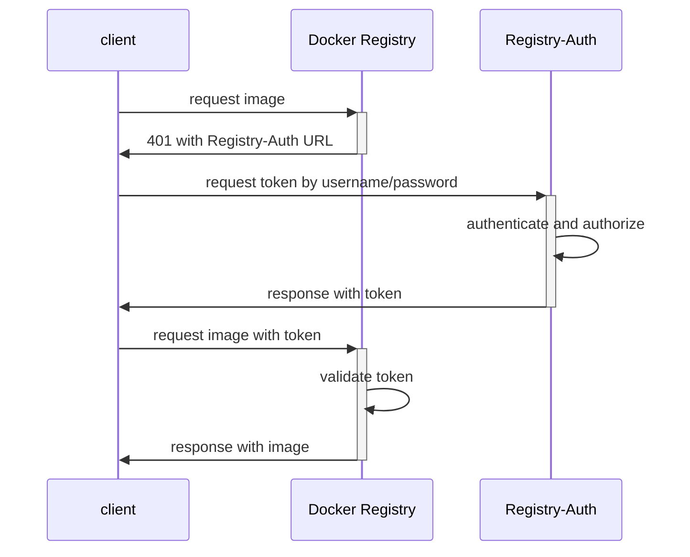
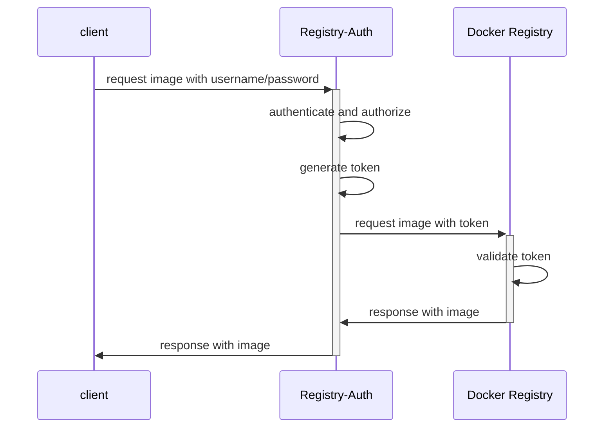

# Registry-Auth


----

`Registry-Auth` 为 [Docker Registry](https://github.com/distribution/distribution) 提供了认证和授权功能。

Docker Registry 支持三种认证方式：silly、htpasswd 和 token。

  * **silly** 仅可适用于开发环境。它要求请求中带有 Authorization 头，但并不检查请求的合法性。

  * **htpasswd** 支持静态地配置用户名密码。Docker Registry 只在启动时加载一次 `htpasswd` 配置。htpasswd 只解决了认证问题，并未解决授权问题。

  * **token** 不但支持用户认证，而且支持用户授权。token 采用了 JWT 格式，包含了有效期和允许的操作。你可以为各个镜像仓库（repository）设置单独的用户权限。

    例如：用户 `test1` 只能从仓库 `repo1` 拉取，而用户 `test2` 能从仓库　`repo2` 推送和拉取。

  * 除了上述方式外，在 Docker 的部署文档中，还提到了`代理`认证方式，即在 Docker Registry 前面部署代理，在代理上做认证。

    有关代理方式的参考：
    1. https://docs.docker.com/registry/deploying/#more-advanced-authentication
    2. https://docs.docker.com/registry/recipes/apache/
    3. https://docs.docker.com/registry/recipes/nginx/

registry-atuh 实现了上述的 Token 认证方式 和 代理认证方式。

## 快速体验

下面的[脚本](./scripts/quick-start.sh)运行了简单的 Registry-Auth 和 Docker Registry 服务，并测试了 docker login、push 及 pull 镜像。

```bash
  curl https://raw.githubusercontent.com/alauda/registry-auth/main/scripts/quick-start.sh | bash
```

## Token 认证
在 Token 认证方式下，Registry-Auth 和 Docker Registry 配置了同一套 x509 证书，由 Registry-Auth 签发 token，由 Docker Registry 验证 token 的合法性。

当 client（docker、containerd等） 访问 Docker Registry 时，Docker Registry 发现请求头中没有 token 时，将返回状态码为 401 的认证失败的响应，并在 "WWW-Authenticate" 响应头中包含 Registry-Auth 的URL。

client 随即用 Basic Authorization 方式将用户名和密码发送给 Registry-Auth。Registry-Auth 验证用户名和密码并检查用户的权限，在通过后将签发 token 返回给 client。

client 再次带着 token 请求 Docker Registry。Docker Registry 验证 token 后返回镜像内容。

Token 认证方式的时序流程如下：


## 代理认证方式

Registry-Auth 的代理认证方式兼容了 Token 认证方式。Registry-Auth 部署在 Docker Registry 之前充当代理，但 Registry-Auth 与 Docker Registry 之间仍然是采用了 token 认证。代理方式对外只需要提供一个访问地址，减少了部署的复杂度，也简化了 client 的请求路径。

当 client 带有 Basic Authorization 访问 Registry-Auth / Docker Registry 时，Registry-Auth 验证用户名和密码并检查用户的权限，然后签发出 token，并把带着 token 的请求传发给 Docker Registry。

Docker Registry 验证 token 后返回镜像内容。

代理认证方式的时序流程如下：


## 配置说明
Registry-Auth 启动时可以通过参数 `--auth-config-file` 指定配置文件，在配置文件中设置用户名密码和针对不同镜像仓库的权限。

配置文件格式及示例如下：
  ```yaml
    users:
      user1: password1           # 使用明文密码
      # 使用bcrypt加密后的密码，可用命令：`htpasswd -nbB user2 password2` 生成加密后的密码
      user2: $2y$05$o.txf8NBl17CimmIKybYYe9SmIcAzctQ84.UbFCObPFxt78W1DEJW
    auths:
      user1:                     # user1的权限配置
      - target: usersrepo/test1  # repoistory名称
        actions:                 # 允许的操作
        - pull
        - push
      - target: team1repo/.*     # 使用正则表达式表示匹配的repoistory名称
        useRegexp: true          # 表示target是使用了正则表达式
        actions:
        - pull
      _anonymous:                # 配置匿名用户的权限，匿名用户登录时不需要提供用户名密码
      - target: .*
        useRegexp: true
        actions:
        - pull
  ```
Registry-Auth 可以通过参数 `--auth-config-selector`，`--auth-config-selector` 和 `--kubeconfig` 从 Kubernetes 的 secrets 中加载配置文件，secrets 的配置优先级高于配置文件。

secrets 示例:
```yaml
apiVersion: v1
kind: Secret
metadata:
  name: registry-auth-example
  labels:
    registry-auth-config: "true"
  namespace: default
type: Opaque
data:
  config: |
    users:
      user3: password3
    auths:
      user3:
      - target: userrepo3/.*
        useRegexp: true
        actions:
        - pull
        - push
```

## 命令行参数:

  | 参数 | 默认值 | 说明 |
  | ------------------------ | ------------------------- | --------------------- |
  | --server-bind-address    |                           | 监听的IP，默认监听所有IP |
  | --server-port            | 8080                      | 监听的端口 |
  | --server-tls-cert-file   |                           | HTTPS的证书路径，可选，不选则以HTTP方式工作 |
  | --server-tls-key-file    |                           | HTTPS的私钥路径，与 --server-tls-cert-file 同时使用 |
  | --auth-public-cert-file  |                           | 签发 token 使用的证书路径，必填 |
  | --auth-private-key-file  |                           | 签发 token 使用的 Key 路径，必填 |
  | --auth-config-file       |                           | 认证配置文件路径，可选 |
  | --auth-config-namespace  |                           | 认证配置所在命名空间，可选 |
  | --auth-config-selector   | registry-auth-config=true | 认证配置所在secret的选择器，可选 |
  | --auth-token-duration    | 600                       | token 的有效时长，单位：秒 |
  | --auth-issuer            | registry-token-issuer     | token 的签发者名称 |
  | --auth-thirdparty-server |                           | 第三方认证服务器地址，可选 |
  | --registry-backend       | 127.0.0.1:5000            | 代理后端registry的地址 |
  | --kubeconfig             |                           | 访问 Kubernetes 的配置文件路径，可选，与 --auth-config-namespace 同时使用 |
  | --log-level              | info                      | 日志级别 |


## Docker Registry 配置说明

当使用 Registry-Auth 时，Docker Registry 也要做必要的设置。
你可以选择通过 **配置文件** 或 **环境变量** 的方式配置 Docker Registry。

你可以在 /etc/docker/registry/config.yml 中配置如下字段：

``` yaml
auth:
  token:
    autoredirect: true                             # 采用代理方式时设为 true，采用 token 方式时设为 false
    realm: /auth/token                             # Registry-Auth URL，在代理方式下，只需要填写相对路径，token 方式下要写全URL，
    service: docker-registry                       # 用于认证服务区分不同的 Docker Registry 实例，目前没使用此特性
    issuer: registry-token-issuer                  # 与 Registry-Auth 的 --auth-issuer 保持一致
    rootcertbundle: /etc/registry-auth/token.crt   # 与 Registry-Auth 的 --auth-public-cert-file 保持一致
```

或者采用上述配置的等价的 **环境变量**进行配置：

| Key | Value |
| --- | ----- |
| REGISTRY_AUTH_TOKEN_AUTOREDIRECT | true |
| REGISTRY_AUTH_TOKEN_REALM | /auth/token |
| REGISTRY_AUTH_TOKEN_SERVICE | token-service |
| REGISTRY_AUTH_TOKEN_ISSUER | registry-token-issuer |
| REGISTRY_AUTH_TOKEN_ROOTCERTBUNDLE | /etc/registry-auth/token.crt |

